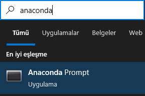
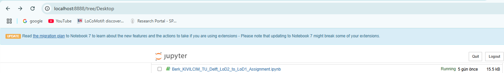
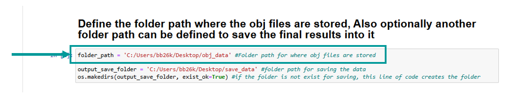
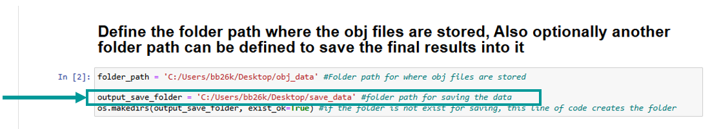
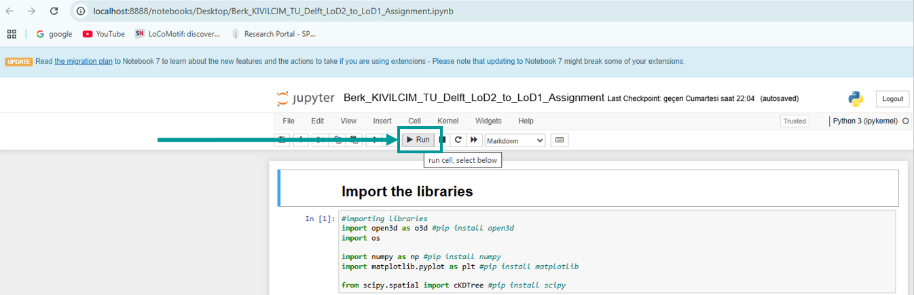
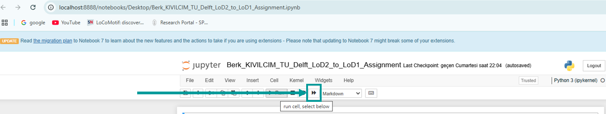
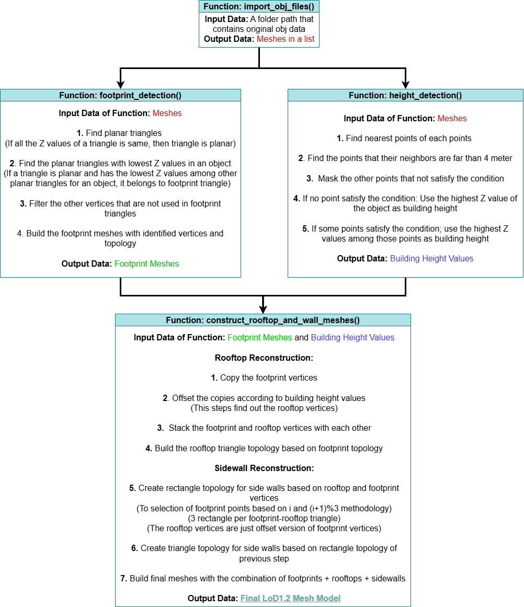

# LoD2 to LoD1 Conversion – TU Delft Assignment

This repository contains a Jupyter Notebook implementation for converting LoD2 building models to LoD1. The code has been written in **Python** inside a **Jupyter Notebook** for better documentation and code readability. Therefore, the file format is `.ipynb` instead of `.py`.

---

## Instructions: How to Run the Notebook

Follow these steps to properly set up and run the code on your local machine:

### Step 1: Download Anaconda

Download the appropriate version of **Anaconda** for your operating system from the official website:

[https://www.anaconda.com/download/success](https://www.anaconda.com/download/success)

---

### Step 2: Launch Anaconda Prompt

After the installation is complete, start the **Anaconda Prompt** application.



---

### Step 3: Install Required Libraries

Run the following commands in the Anaconda Prompt to install the necessary Python libraries:

```bash
pip install open3d
pip install numpy
pip install matplotlib
pip install scipy
```
---

### Step 4: Start Jupyter Notebook

Once the required libraries are installed, launch Jupyter Notebook by entering the following command in the Anaconda Prompt:

```bash
jupyter notebook
```
---

### Step 5: Open the Notebook File

A localhost web page will open in your browser. Download the **Berk_KIVILCIM_TU_Delft_LoD2_to_LoD1_Assignment.ipynb** file and locate the file in the directory where you downloaded it. 



---

### Step 6: Defining the Folder Path Where .obj Files Are Stored

Store your `.obj` files inside a dedicated folder on your computer.

Then, in the notebook, go to the second cell and update the variable **`folder_path`** by assigning it the path to the folder where your `.obj` files are stored. For example:



**Optional:**  If you wish to save the generated LoD1 models in `.obj` format at the end of the process, the folder path where these files will be saved can also be defined in this section.



---

### Step 7: Exeute All Cells in Order

Now you can execute the notebook by clicking the **"Run"** button in the toolbar, starting from the **first cell** and proceeding **in sequential order**.

⚠️ It is important to run the cells **in order**, as some later cells depend on variables or computations from earlier ones.



Alternatively, you can click the button shown below image to automatically **restart the kernel** and **run all cells** in sequential order.  
This will ensure that the notebook executes cleanly from top to bottom.



---

### Visualization: 

After a successful execution of the code, a **visualization window** will appear, allowing you to interactively inspect the generated model. 

Once you close the visualization window, the notebook will proceed to the next cell and automatically save the generated LoD1 models, if an output path has been properly defined.

---

### How Algorithm Works: 

A figure that gives an overview about how the algorithm works presented below here.


